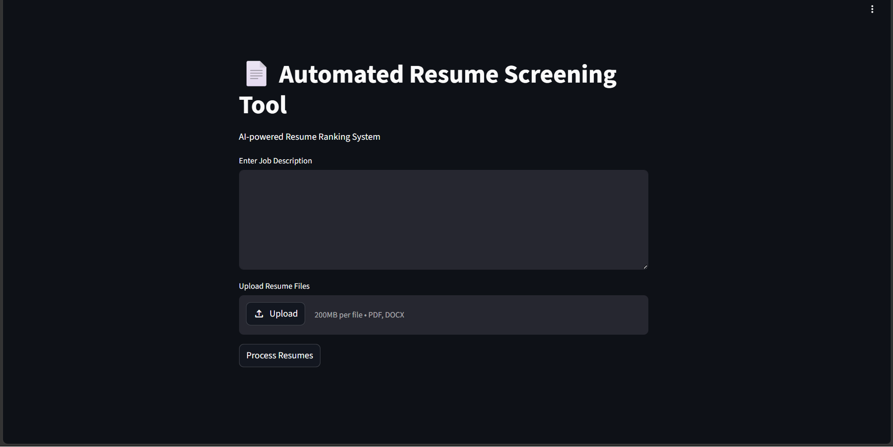
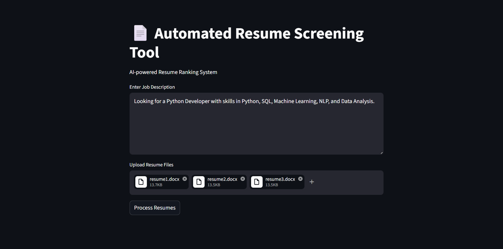
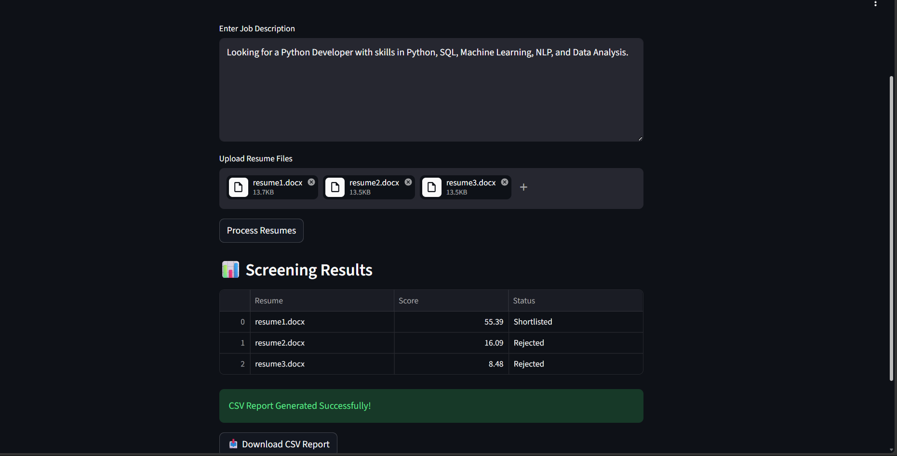

# Automated Resume Screening Tool

## 📌 Project Overview

The Automated Resume Screening Tool is an AI-powered application developed using Python and NLP techniques to automate the resume shortlisting process.

The system extracts text from resumes, compares resumes with job descriptions, calculates similarity scores using TF-IDF and cosine similarity, ranks candidates, and generates shortlist reports automatically.

This project simulates a real Applicant Tracking System (ATS) used by companies and HR teams.

---

# 🚀 Features

- Resume Upload System
- PDF Resume Extraction
- DOCX Resume Extraction
- Job Description Matching
- NLP-based Resume Analysis
- TF-IDF Vectorization
- Cosine Similarity Scoring
- Resume Ranking
- Shortlist / Reject Decision
- CSV Report Generation
- Streamlit Web Interface

---

# 🧠 Technologies Used

| Technology | Purpose |
|---|---|
| Python | Core Programming |
| Pandas | Data Handling |
| NumPy | Numerical Operations |
| Scikit-learn | TF-IDF & Cosine Similarity |
| PyPDF2 | PDF Text Extraction |
| python-docx | DOCX Text Extraction |
| Regex | Text Cleaning |
| Streamlit | Web Application UI |

---

# 🏗️ Project Architecture

```text
Resume Upload
      ↓
Text Extraction
      ↓
Text Cleaning
      ↓
TF-IDF Vectorization
      ↓
Cosine Similarity
      ↓
Resume Ranking
      ↓
Shortlist Decision
      ↓
CSV Report Generation
```

---

# 📂 Folder Structure

```text
Automated-Resume-Screening-Tool/
│
├── resumes/
├── outputs/
├── images/
├── app.py
├── main.py
├── requirements.txt
├── .gitignore
└── README.md
```

---

# ⚙️ Installation

## Clone Repository

```bash
git clone https://github.com/skkiranmayee-789/Automated-Resume-Screening-Tool
```

---

## Create Virtual Environment

### Windows

```bash
python -m venv venv
venv\Scripts\activate
```

### Mac/Linux

```bash
python3 -m venv venv
source venv/bin/activate
```

---

## Install Required Libraries

```bash
pip install -r requirements.txt
```

---

# ▶️ Run The Project

## Run Streamlit Application

```bash
streamlit run app.py
```

---

# 📊 Sample Job Description

```text
Looking for a Python Developer with skills in Python, SQL, Machine Learning, NLP, and Data Analysis.
```

---

# 📈 Sample Output

| Resume | Score | Status |
|---|---|---|
| resume1.docx | 55.39 | Shortlisted |
| resume2.docx | 16.09 | Rejected |
| resume3.docx | 8.48 | Rejected |

---

# 📸 Screenshots

## Home Page



---

## Uploaded Resumes



---

## Resume Ranking Results



---

# 🎯 Learning Outcomes

Through this project, I learned:

- NLP basics
- Resume parsing
- Text preprocessing
- TF-IDF vectorization
- Cosine similarity
- Streamlit development
- Automation concepts
- GitHub project management

---

# 💡 Industry Relevance

This project demonstrates how companies use Applicant Tracking Systems (ATS) to automate hiring processes by analyzing resumes and matching candidates with job requirements.

---

# 🔮 Future Improvements

- Advanced NLP models
- Skill extraction system
- Resume analytics dashboard
- Database integration
- Cloud deployment
- AI-powered recommendations

---

# 👨‍💻 Author

Developed by:
Sivvam Karthikeya Kiranmayee

---

# ⭐ Conclusion

The Automated Resume Screening Tool is a beginner-friendly yet industry-relevant AI/NLP project that demonstrates automation, resume analysis, and candidate ranking using Python and machine learning concepts.